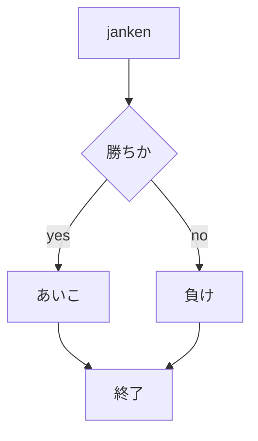

# webpro_06
2024/10/29
## このプログラムに関して

##　ファイル一覧
ファイル名|説明
-|-
app5.js | プログラム本体
public/janken.html | じゃんけんの開始画面
public/atti.html | あっち向いてホイの開始画面
public/coin.html | コイントスの開始画面
views/janken.html | じゃんけんの開始表示，入力
views/atti.html | あっち向いてホイの表示，入力
views/coin.html | コイントスの表示，入力
```javascript
console.log('Hello');
```

##　使用方法