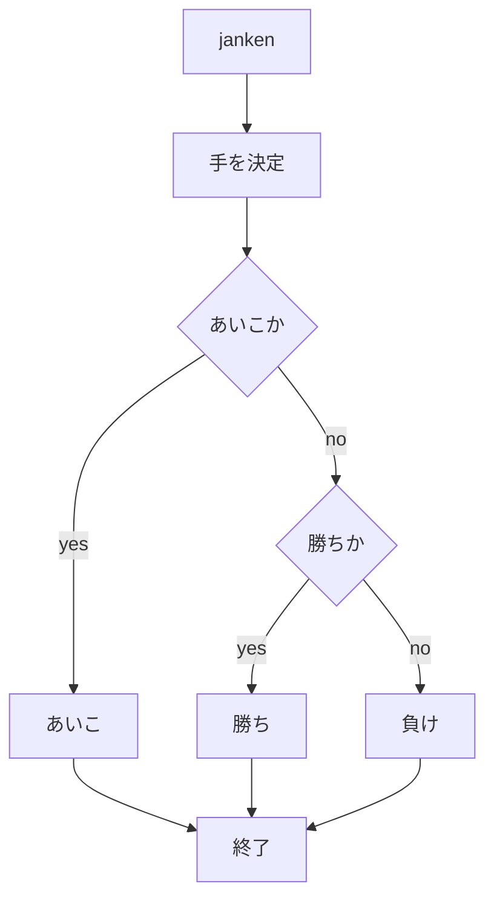
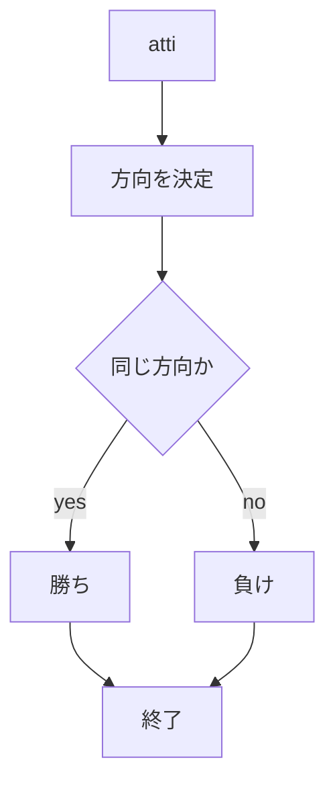
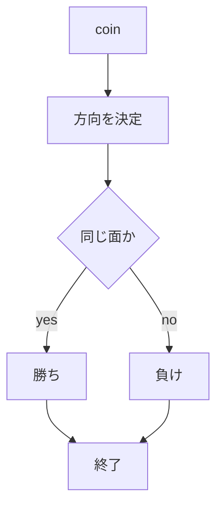

# webpro_06
2024/10/29
## このプログラムに関して

##　ファイル一覧
ファイル名|説明
-|-
app5.js | プログラム本体
public/janken.html | じゃんけんの開始画面
public/atti.html | あっち向いてホイの開始画面
public/coin.html | コイントスの開始画面
views/janken.html | じゃんけんの開始表示，入力
views/atti.html | あっち向いてホイの表示，入力
views/coin.html | コイントスの表示，入力

## ソースコード
### app5.js

```javascript
const express = require("express");
const app = express();

app.set('view engine', 'ejs');
app.use("/public", express.static(__dirname + "/public"));

app.get("/hello1", (req, res) => {
  const message1 = "Hello world";
  const message2 = "Bon jour";
  res.render('show', { greet1:message1, greet2:message2});
});

app.get("/hello2", (req, res) => {
  res.render('show', { greet1:"Hello world", greet2:"Bon jour"});
});

app.get("/icon", (req, res) => {
  res.render('icon', { filename:"./public/Apple_logo_black.svg", alt:"Apple Logo"});
});

app.get("/luck", (req, res) => {
  const num = Math.floor( Math.random() * 6 + 1 );
  let luck = '';
  if( num==1 ) luck = '大吉';
  else if( num==2 ) luck = '中吉';
  console.log( 'あなたの運勢は' + luck + 'です' );
  res.render( 'luck', {number:num, luck:luck} );
}); 

app.get("/janken", (req, res) => {
  let hand = req.query.hand;
  let win = Number(req.query.win)||0;
  let total = Number(req.query.total)||0;
  console.log( {hand, win, total});
  const num = Math.floor( Math.random() * 3 + 1 );
  let cpu = '';
  if( num==1 ) cpu = 'グー';
  else if( num==2 ) cpu = 'チョキ';
  else cpu = 'パー';
if(cpu==hand){
  judgement = 'あいこ';
  console.log('あいこ');
} else if ((hand == 'グー' && cpu == 'チョキ')||(hand == 'チョキ' && cpu == 'パー')||(hand == 'パー' && cpu == 'グー')||(hand == 'ムテキ')){
  judgement = '勝ち';
  console.log('勝ち');
  win++;
} else {
  judgement = '負け';
  console.log('負け');
}
  total++;
  const display = {
    your: hand,
    cpu: cpu,
    judgement: judgement,
    win: win,
    total: total
  }
  res.render( 'janken', display );
});

app.get("/atti", (req, res) => {
  let dir = req.query.dir;
  let win = Number(req.query.win)||0;
  let total = Number(req.query.total)||0;
  console.log( {dir, win, total});
  const num = Math.floor( Math.random() * 4 + 1 );
  let cpu = '';
  if( num==1 ) cpu = '上';
  else if( num==2 ) cpu = '右';
  else if( num==3 ) cpu = '左';
  else cpu = '下';
if(cpu==dir){
  judgement = '勝ち';
  console.log('勝ち');
  win++;
} else {
  judgement = '負け';
}
  total++;
  const display = {
    your: dir,
    cpu: cpu,
    judgement: judgement,
    win: win,
    total: total
  }
  res.render( 'atti', display );
});

app.get("/coin", (req, res) => {
  let coin = req.query.coin;
  let win = Number(req.query.win)||0;
  let total = Number(req.query.total)||0;
  console.log( {coin, win, total});
  const num = Math.floor( Math.random() * 2 + 1 );
  let cpu = '';
  if( num==1 ) cpu = '表';
  else cpu = '裏';
if(cpu==coin){
  judgement = '勝ち';
  console.log('勝ち');
  win++;
} else {
  judgement = '負け';
  console.log('負け');
}
  total++;
  const display = {
    your: coin,
    cpu: cpu,
    judgement: judgement,
    win: win,
    total: total
  }
  res.render( 'coin', display );
});

app.listen(8080, () => console.log("Example app listening on port 8080!"));
```
## フローチャート
### app5.js


### atti.ejs

### coin.ejs

##　使用方法
ターミナルを開き，jsファイルがあるディレクトリに移動してから
node app5.js
を入力する．
次に，ブラウザを開き
じゃんけんの場合は
http://localhost:8080/janken
あっち向いてほいの場合は
http://localhost:8080/atti
コイントスの場合は
http://localhost:8080/coin
をアドレスバーに入れる．