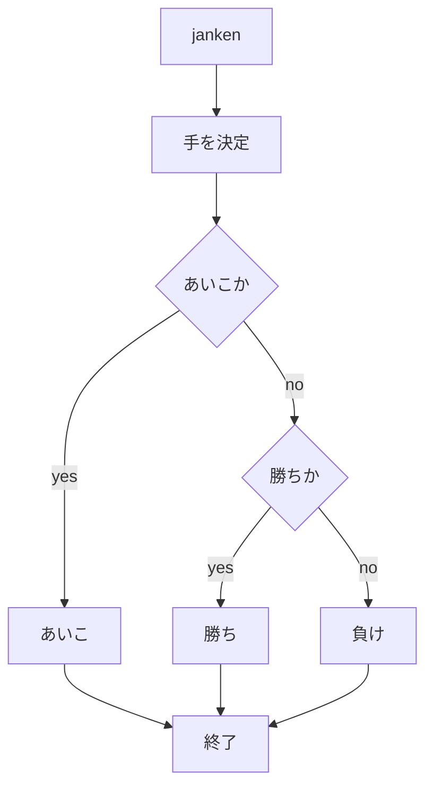
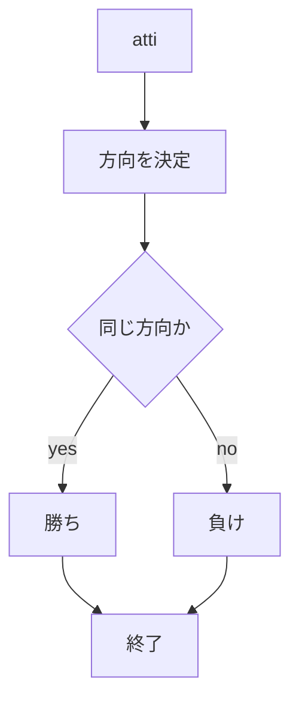
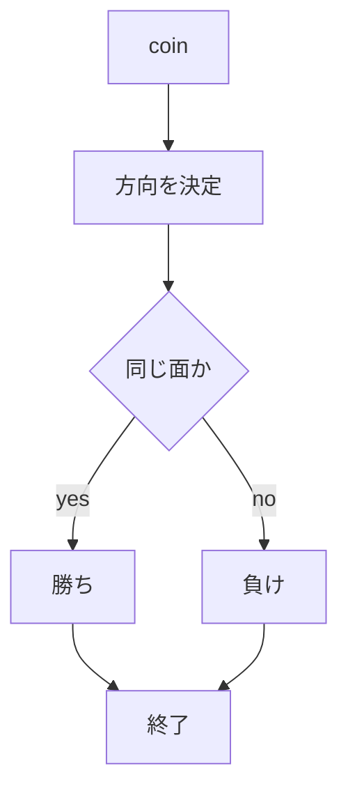

# webpro_06
2024/10/29
## このプログラムに関して

##　ファイル一覧
ファイル名|説明
-|-
app5.js | プログラム本体
public/janken.html | じゃんけんの開始画面
public/atti.html | あっち向いてホイの開始画面
public/coin.html | コイントスの開始画面
views/janken.html | じゃんけんの開始表示，入力
views/atti.html | あっち向いてホイの表示，入力
views/coin.html | コイントスの表示，入力

## じゃんけんについて
自分の出す手（「グー」、「チョキ」、「パー」）を入力欄に入れボタンをクリックすると、じゃんけんができる。
「ムテキ」と入力すると必ず勝てるようになっている。
###　実行手順

1:app5.jsを起動する。
2:次に，webブラウザでhttp://localhost:8080/jankenにアクセスする
3:出したい手を入力する。
### フローチャート

## あっち向いてホイについて
自分が指す方向（「上」、「下」、「右」、「左」）を入力しボタンをクリックすることであっちむいてホイができる。
###　実行手順

1:app5.jsを起動する。
2:次に，webブラウザでhttp://localhost:8080/attiにアクセスする
3:出したい手を入力する
### フローチャート

## コイントスについて
「表」「裏」のうち、出ると思う方の麺を入力してボタンを押すと勝敗が決まる。
###　実行手順

1:app5.jsを起動する。
2:次に，webブラウザでhttp://localhost:8080/coinにアクセスする。
3:出したい手を入力する
### フローチャート
