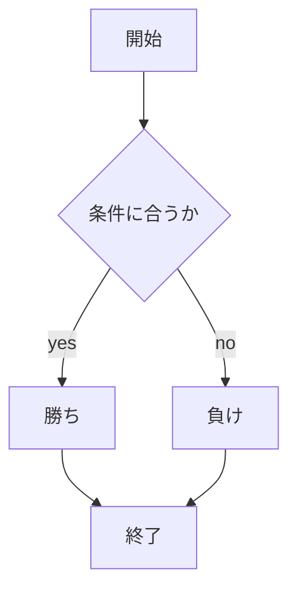

# webpro_06
2024/10/29
## このプログラムに関して

##　ファイル一覧
ファイル名|説明
-|-
app5.js | プログラム本体
public/janken.html | じゃんけんの開始画面
```javascript
console.log('Hello');
```

```mermaid
flowchart TD;

start["開始"];
end1["終了"]
if{"条件に合うか"}
win["勝ち"]
loose["負け"]

start --> if
if -->|yes| win
win --> end1
if -->|no| loose
loose --> end1
```
##　使用方法