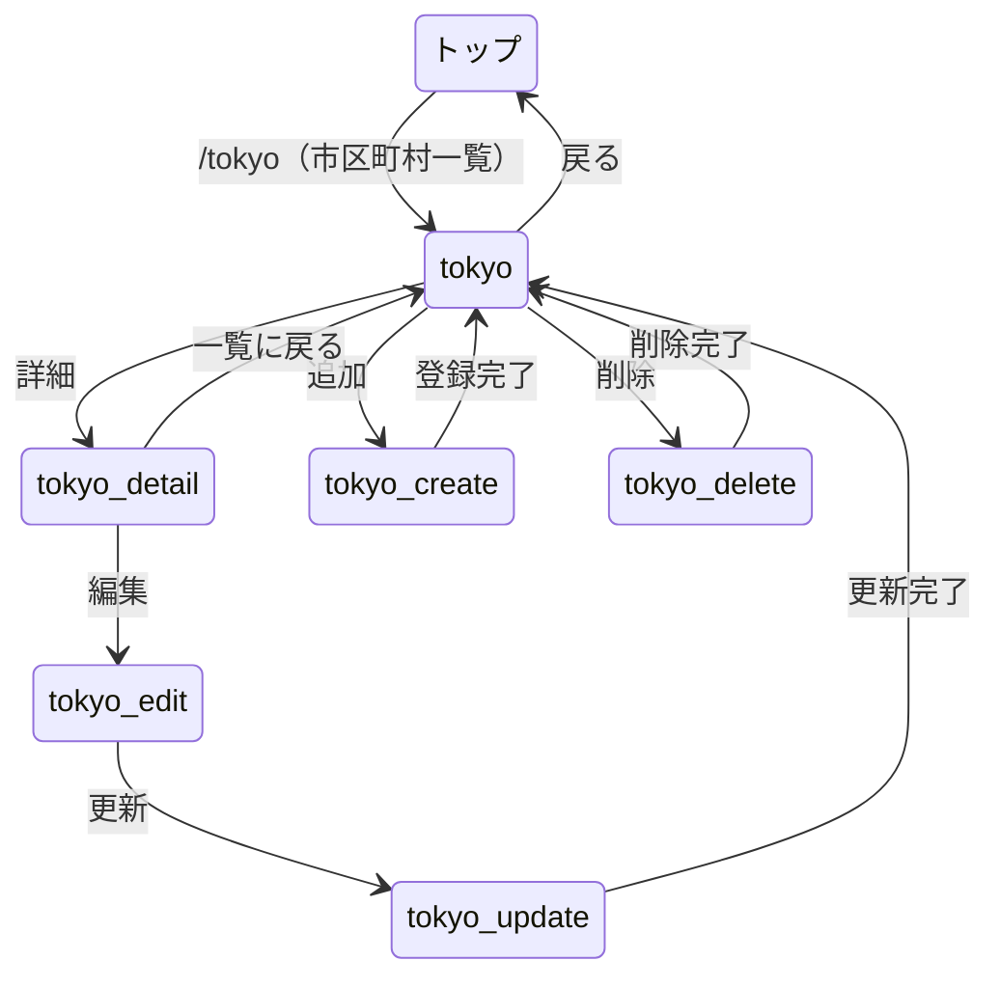
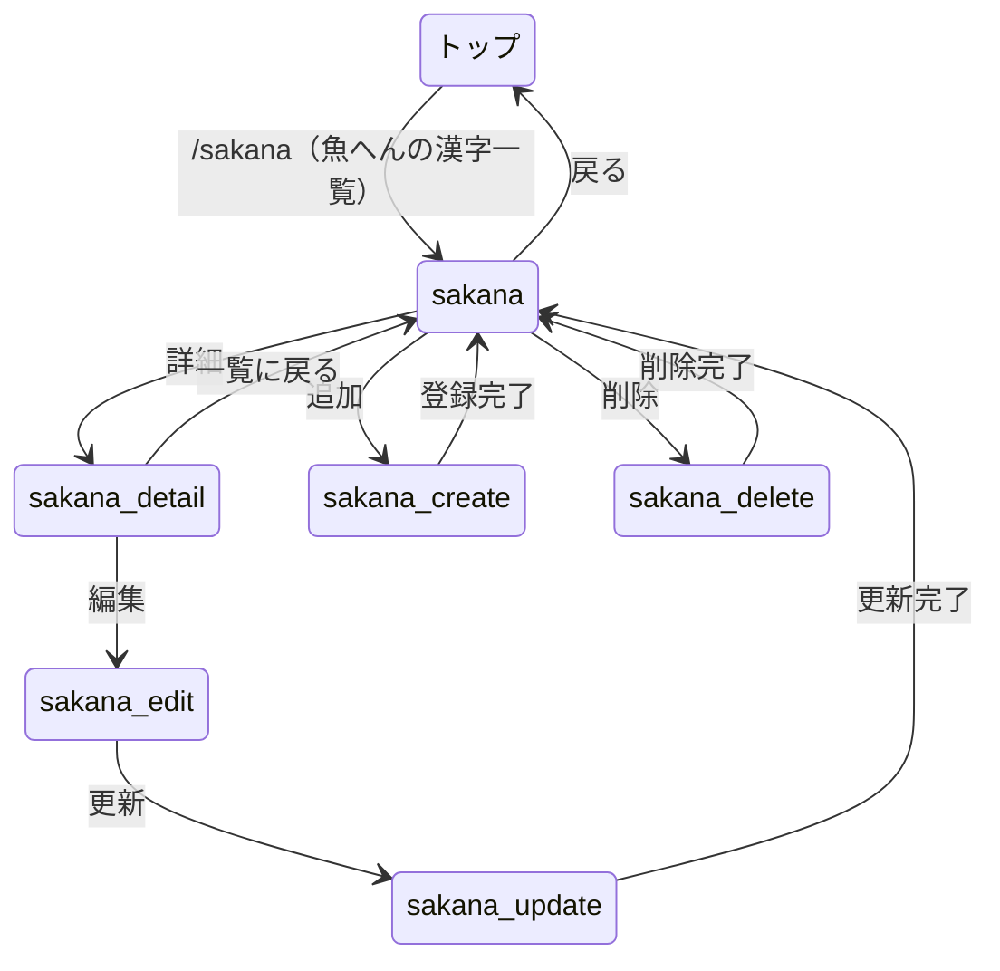
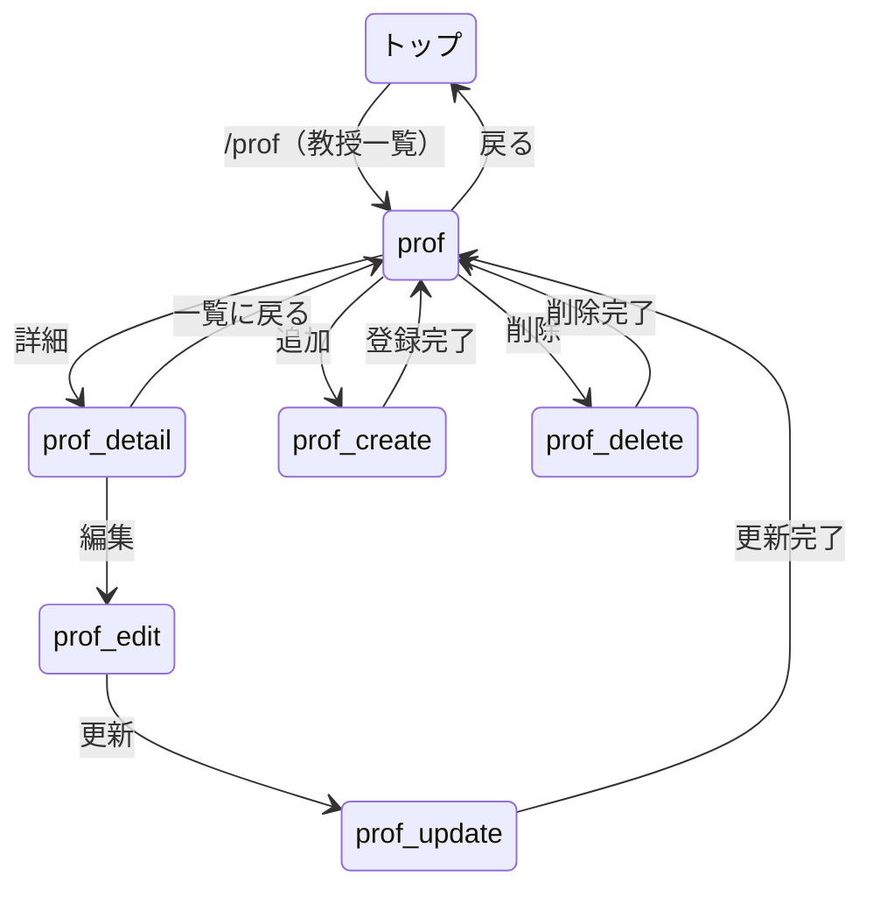

```mermaid
stateDiagram-v2
トップ --> tokyo: /tokyo（市区町村一覧）
tokyo --> トップ: 戻る

tokyo --> tokyo_detail: 詳細
tokyo --> tokyo_create: 追加
tokyo --> tokyo_delete: 削除

tokyo_detail --> tokyo: 一覧に戻る
tokyo_detail --> tokyo_edit:編集

tokyo_edit --> tokyo_update:更新
tokyo_update --> tokyo: 更新完了

tokyo_create --> tokyo: 登録完了
tokyo_delete --> tokyo: 削除完了


```

```mermaid
stateDiagram-v2
トップ --> sakana: /sakana（魚へんの漢字一覧）
sakana --> トップ: 戻る

sakana --> sakana_detail: 詳細
sakana --> sakana_create: 追加
sakana --> sakana_delete: 削除

sakana_detail --> sakana: 一覧に戻る
sakana_detail --> sakana_edit:編集

sakana_edit --> sakana_update:更新
sakana_update --> sakana: 更新完了

sakana_create --> sakana: 登録完了
sakana_delete --> sakana: 削除完了


```

```mermaid
stateDiagram-v2
トップ --> prof: /prof（教授一覧）
prof --> トップ: 戻る

prof --> prof_detail: 詳細
prof --> prof_create: 追加
prof --> prof_delete: 削除

prof_detail --> prof: 一覧に戻る
prof_detail --> prof_edit:編集

prof_edit --> prof_update:更新
prof_update --> prof: 更新完了

prof_create --> prof: 登録完了
prof_delete --> prof: 削除完了


```